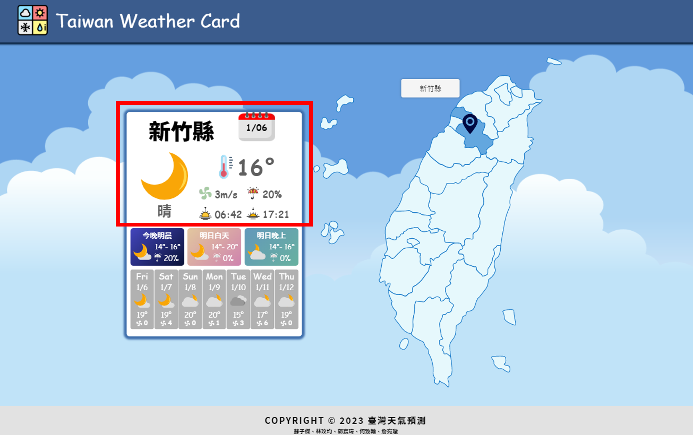
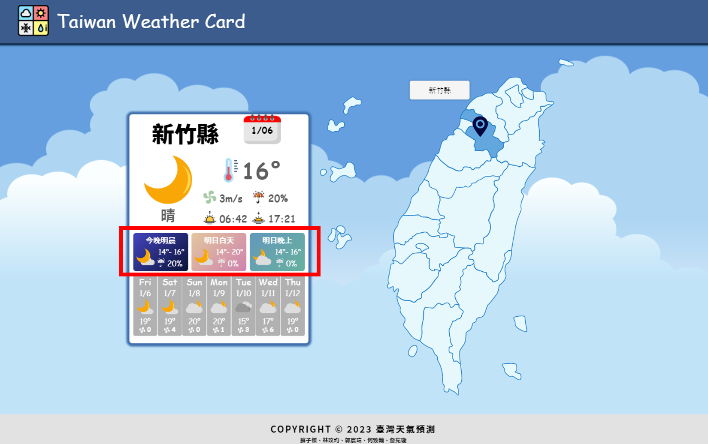
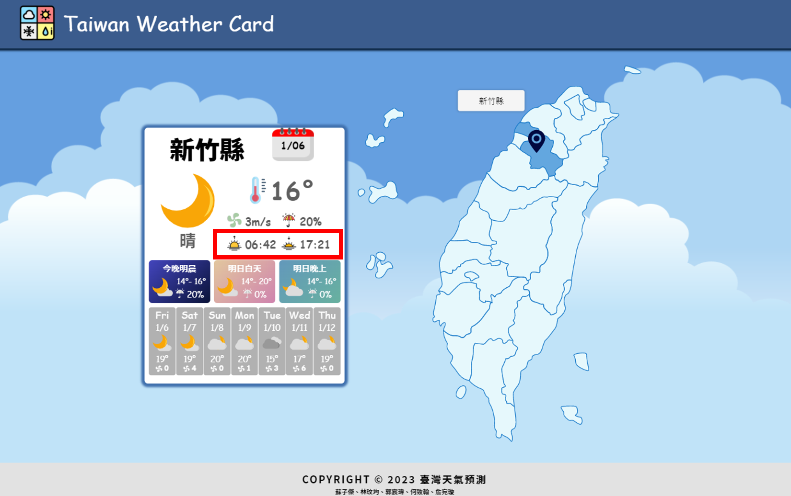
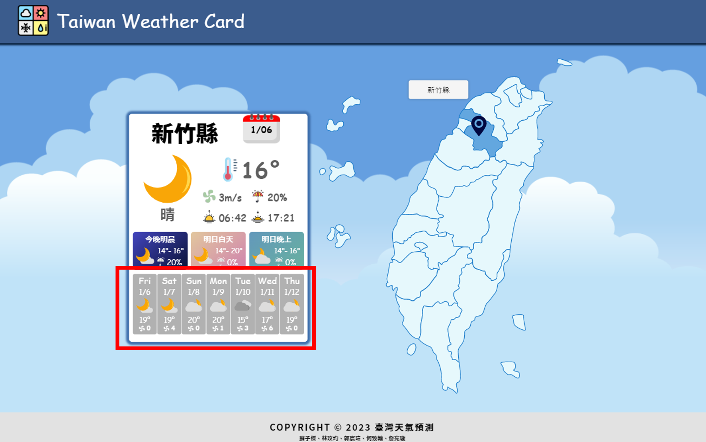

# Taiwan-Weather-Cards

[Taiwan-Weather-Cards](https://jacky-stc.github.io/Taiwan-Weather-Cards/)

本專案是以 WeHelp Boot Camp 第二階段第八週任務題目為依據，利用 JavaScript 串接中華民國交通部中央氣象局 API，並以 HTML、CSS 等語言撰寫而成的天氣預報網站。本專案適用於各種尺寸的頁面，以利使用者以不同的裝置來使用。

This project is the 8th-week task of the WeHelp Bootcamp, and is a Taiwan weather forecast website designed with responsive web design(RWD) using mainly JavaScript. Weather information is fetched from the APIs of the Central Weather Bureau, which is under the Ministry of Transportation and Communications in Taiwan.

網站分成兩個區塊，點擊地圖後可以看見相應縣市的天氣預報資訊。

The website has two sections: weather cards and a map of Taiwan. Users can click on different cities on the map to view their corresponding weather forecast.

# 響應式設計呈現 The Responsive Web Design (RWD)

- RWD 中斷點： 1200px、1024px、768px 以及 480px

  > 可配合多款不同裝置來顯示畫面。在 768px 的介面之下，將畫面分割為上、下兩部分呈現。
  >   The website has responsive design breakpoints set at 1200px, 1024px, 768px, and 480px, allowing it to be displayed on various devices. For interfaces under 768px, the screen is divided into upper and lower parts for presentation.

# 資料串接 Integration of APIs

<h3>取得當下天氣狀況 Fetching the current weather forecast </h3>

> API：`https://opendata.cwb.gov.tw/api/v1/rest/datastore/F-D0047-089?Authorization=${key}`

- 以下為初始資料 Data:

- 利用 for 迴圈將各資料取出，並只取第一筆時間資料，最後統整成一個 object。
   Using a “for loop” to extract each piece of data, and selecting only the first instance of time data to consolidate into an object.

 

<h3>取得近36小時的天氣資料 Fetching the 36-hour weather forecast data</h3>

> API：`https://opendata.cwb.gov.tw/api/v1/rest/datastore/F-D0047-091?Authorization=${key}`

- 以下為初始資料 Data:

> 利用 for 迴圈將各資料取出，並判斷取得之資料為「今日白天」、「今日晚上」、「今晚明晨」、「明日白天」、「明日晚上」。
>   Using a for loop to extract the start time from each piece of data, and determining whether the data obtained is for “today daytime”, “today nighttime”, “tonight to tomorrow morning”, “tomorrow daytime”, or “tomorrow nighttime”.

> 將資料內 start time 取出並判斷是什麼時間點，部分時間會利用 new Date()來判斷是今日或明日。
>   In some cases, “new Date()” is used to determine whether the start time is for today or tomorrow.

- 以下為判斷方法 Method of determination：

- 最後將資料打包 Packing data：

 

<h3>取得一週的天氣資料 Fetching the weekly weather forecast data</h3>

> API：`https://opendata.cwb.gov.tw/api/v1/rest/datastore/F-C0032-001?Authorization=${key}`

- 以下為初始資料 Data:

> 利用 for 迴圈將各資料取出，因為氣象局會隨時間更新資料，所以要在更新時更換要取的時間，才能正確取得資料。
>   Using a “for loop’ to extract each piece of data, and due to the fact that the Central Weather Bureau updates its data over time, the time to be extracted must be changed during the update to obtain the data correctly.

> 以上圖為例，0 是資料當天，而一週資料就要取[0, 1, 3, 5, 7, 9, 11]。
>   Taking the figures above as an example, '0' represents the data for the current day, and to obtain the one-week data, the times to be extracted are [0, 1, 3, 5, 7, 9, 11].

- 下圖為判斷方法 Method of determination：

  > 當時間為 18:00 時，資料要取[0, 1, 3, 5, 7, 9, 11]；時間為 00:00 時要取[1, 3, 5, 7, 9, 11, 13]；其他時間為[0, 2, 4, 6, 8, 10, 12]。其中要注意換天的問題，若氣象局已經更新資料但實際時間還在前一天，那天數就要+1，反之不用。
  >   When the time is 18:00, the data to be extracted is [0, 1, 3, 5, 7, 9, 11]; when the time is 00:00, the data to be extracted is [1, 3, 5, 7, 9, 11, 13]; for all other times, the data to be extracted is [0, 2, 4, 6, 8, 10, 12]. It is important to note the issue of changing days. If the Central Weather Bureau has already updated the data but the actual time is still on the previous day, then the day number needs to be increased by 1; otherwise, it does not need to be increased.

- 最後將資料打包，注意這邊我將 0 設為禮拜天、1 為禮拜一...以此類推。
    Finally, the data is packaged, and note that '0' is set as Sunday, '1' as Monday, and so on.

 

<h3>取得當天的日落日出時間 Fetching Today's Sunrise and Sunset Times</h3>

> 因為氣象局的日落日出資料已經包含一整年的時間，不需要去管更新問題，所以直接用 API 控制日期，取今日資料即可。
>   Since the Central Weather Bureau's data on sunrise and sunset times contains information for an entire year, there is no need to worry about updates. Therefore, the API can be used to retrieve today's data by selecting the date directly.
> API：`https://opendata.cwb.gov.tw/api/v1/rest/datastore/A-B0062-001?Authorization=${key}&timeFrom=${nowDate}&timeTo=${nextDate}`

- 以下為初始資料 Data:

- 利用 for 迴圈將各資料取出，最後打包就好
    Extracting each piece of data using "for loops", and finally packaging them together.：

 

<h3>最後資料統整 Data consolidated</h3>
最後將資料統成一個object，提供給前端使用 Finally, all the data is consolidated into a single object and provided for use by the frontend.
  

# 功能說明 Function Description

- 點擊互動效果 Interactive Effects by Clicking

  > 透過鼠標點擊台灣地圖即可取得點擊縣市之天氣資料。
  >   Clicking on the Taiwan map with the mouse allows the weather data for the selected city to be obtained.

- 使用者位置 User Location

  > 使用 Geolocation API 取得使用者當前地理位置之**經緯度**，並透過 Google Maps API 轉換為台灣縣市後串接縣市資料呈現於網頁上。 註：若使用者拒絕存取當前地理位置，則呈現預設縣市【台北市】之天氣資料。
  >   The Geolocation API is used to obtain the latitude and longitude of the user's current location, which is then converted into a Taiwan city by using the Google Maps API and integrated with the city data for display on the webpage. Note: If the user declines to provide access to their current location, the weather data for the default city, the Taipei City, will be displayed.

- 現在天氣 Current Weather

  > 呈現當前所在縣市或所選擇縣市之當下天氣情形，其中包含天氣狀況（晴、陰、多雲、有雨...等）、溫度、風速、降雨機率。
  >   Displays the current weather conditions for the selected or current city, including the weather condition (sunny, cloudy, rainy, etc.), temperature, wind speed, and chance of precipitation.

  

- 36 小時預測天氣 36-hour Weather Forecast

  > 呈現當前所在縣市或所選擇縣市之未來 36 小時天氣情形，每 12 個小時為一單位。其中包含天氣狀況（晴、陰、多雲、有雨...等）、溫度、降雨機率。
  >   Displays the weather conditions for the selected or current city for the next 36 hours, with each 12-hour period as a unit. This includes the weather condition (sunny, cloudy, rainy, etc.), temperature, and chance of precipitation.

  

- 日出日落時間 Sunrise and Sunset Times

  > 呈現當前所在縣市或所選擇縣市之日出日落情形，每 12 個小時為一單位。其中包含天氣狀況（晴、陰、多雲、有雨...等）、溫度、降雨機率。
  >   Displays the sunrise and sunset times for the selected or current city, with each 12-hour period as a unit. This includes the weather condition (sunny, cloudy, rainy, etc.), temperature, and chance of precipitation.

  

- 一周天氣預測 Weekly Weather Forecast

  > 呈現當前所在縣市或所選擇縣市自當前日期往後一周之天氣情形。其中包含星期、日期、天氣狀況（晴、陰、多雲、有雨...等）、溫度、風速。
  >   Displays the weather conditions for the selected or current city for the upcoming week starting from the current date. This includes the day of the week, date, weather condition (sunny, cloudy, rainy, etc.), temperature, and wind speed.

  

# 組員分工 Team Member Roles

- 版面刻劃 Page Layout

  > 台灣地圖 Taiwan Map：<a href="https://github.com/viviweikuo">郭宸瑋 Vivian Kuo</a> 
  > 天氣圖表：<a href="https://github.com/wanhsuan625">詹宛璇 Bonnie Zhan</a>

- 天氣平台資料串接 Integration of Weather Platform APIs and Data

  > <a href="https://github.com/cvbn55688">何致翰 Zhi-Han Ho</a>

- 網頁事件互動 Webpage Interactive Events

  > <a href="https://github.com/Jacky-stc">蘇子傑 Tzu-Chieh Su</a>、<a href="https://github.com/vivian-wj-lin">林玟均 Vivian Lin</a>
